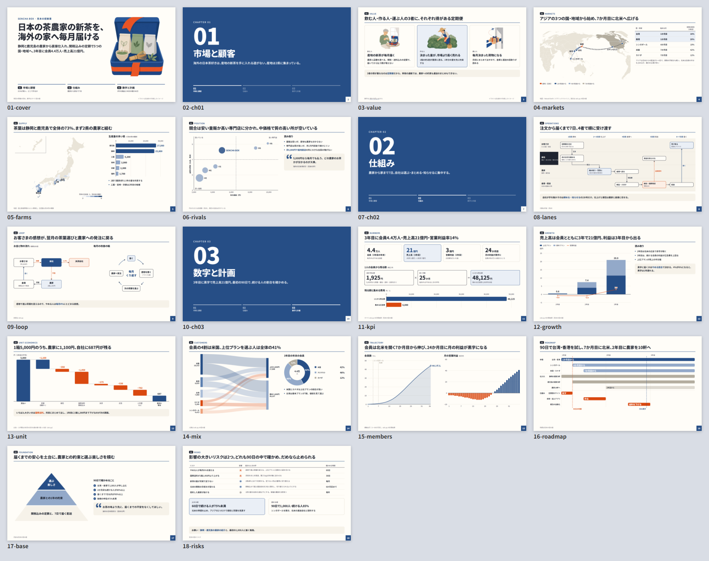
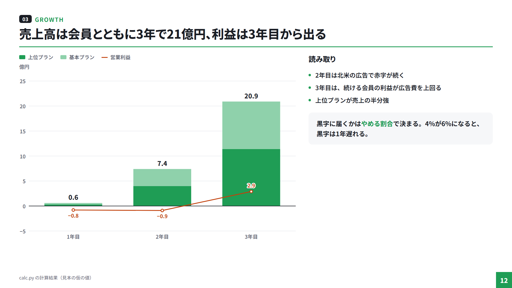
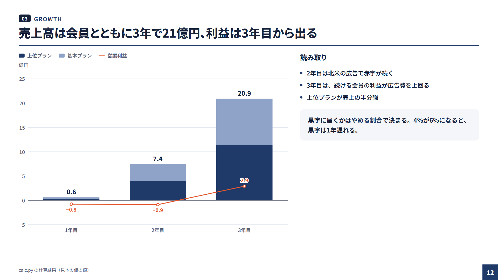
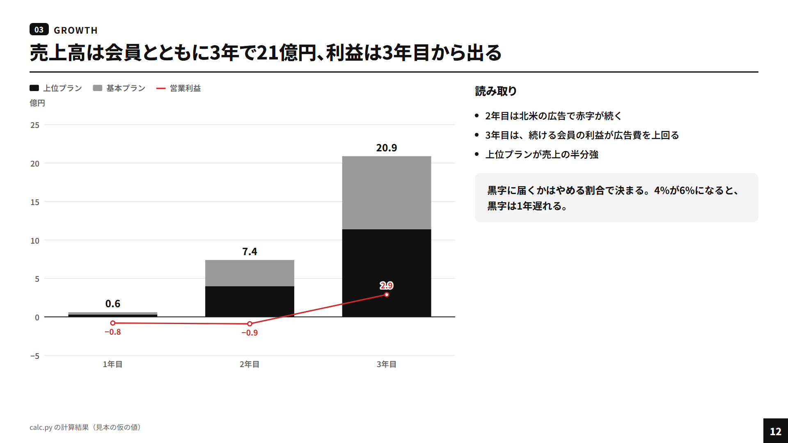
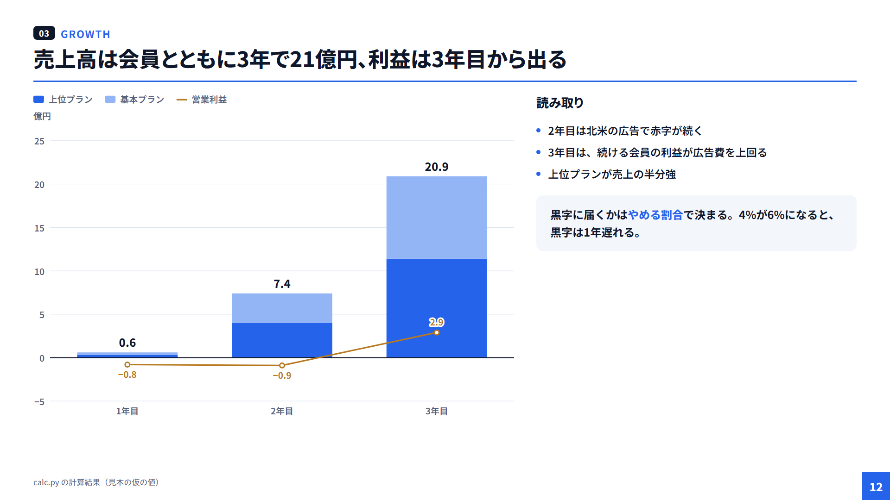
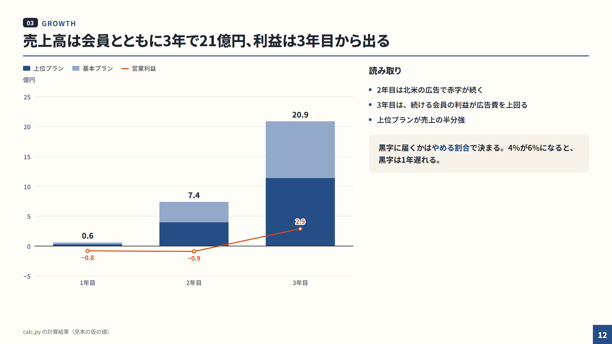
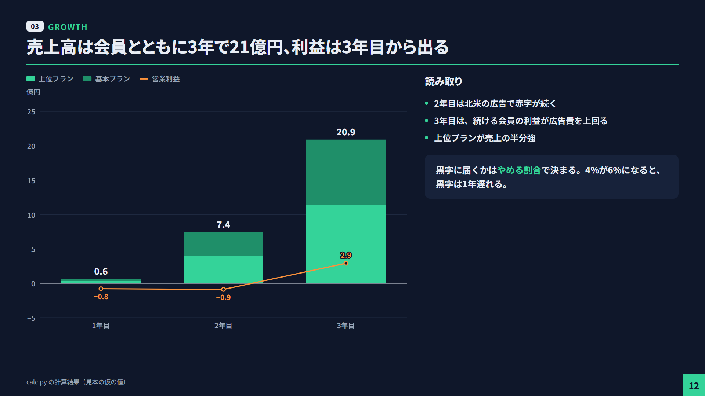
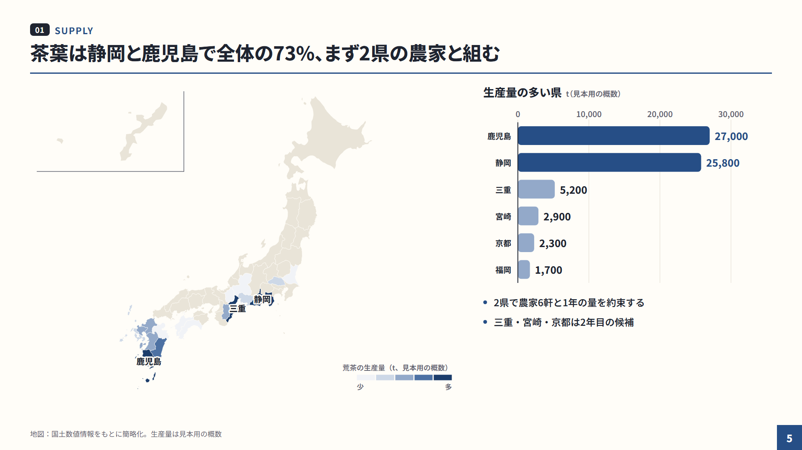
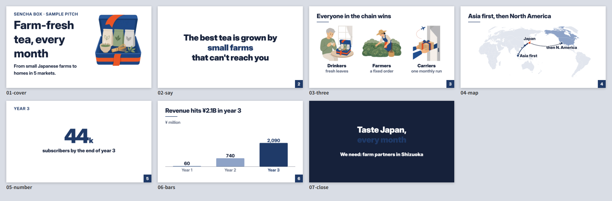

# html-slides

**Cursor の Agent Skill：きれいな 1920×1080 の HTML スライドを、毎回同じ品質で作る。**
グラフ・図・地図・計算の埋め込み・イラスト・PNG の書き出しと自動の検査まで 1 つに入っています。

[English](#english) ・ [日本語](#日本語)



---

## 日本語

### できること

- **1 ファイルの HTML デッキ**：1 ページ＝1 つの `<section>`（1920×1080 固定、画面に合わせて拡大縮小）。CSS・JS・データ・地図を埋め込み、フォントを同梱するので **オフラインで開ける**
- **2 つの型**：資料（`doc`、読んで分かる）と発表（`pitch`、文字 54px 以上・発表者メモ・連動する発表者の窓・目標時刻）
- **6 つのテーマ**：`green` `navy` `mono` `blue` `wa`（和風）`dark`。強調色とお金・注意の色の 2 色で組む
- **自前の SVG グラフ**：縦棒・横棒・積み上げ（100% も）・棒と線の複合（右の軸）・線・面・ドーナツ・散布・バブル・滝・サンキー・ガント
- **図**：関係図・担当者ごとのフロー図（スイムレーン）・循環図・ツリー。箱は HTML、矢印は自動で引く
- **地図**：世界・国ごと・日本の都道府県（沖縄の差し込み付き）。塗り分け・点・弧。Natural Earth から SVG を作って埋め込む
- **数字は計算から**：Python で計算した JSON を埋め込み、`data-f="rev.y3"` やグラフの `"@path"` で参照。前提を変えても食い違わない
- **イラスト**：テーマごとに固定したスタイルの指示で生成し、背景を透明にして webp に（Cursor の GenerateImage 用）
- **自動の検査**：Chrome headless で全ページを撮り、はみ出し・画面外・小さすぎる文字・データの抜け・空の地図・画像の抜け・id の重複を赤枠で一覧に
- **日本語と英語**、Windows・Mac（Node 18 以上＋Chrome か Edge）

### 入れ方

```bash
# Cursor の個人スキルの場所に置く
git clone https://github.com/32Lwk/html-slides.git ~/.cursor/skills/html-slides
cd ~/.cursor/skills/html-slides/scripts && npm install     # 地図に使う d3-geo・topojson-client
```

Windows（PowerShell）は `git clone https://github.com/32Lwk/html-slides.git "$env:USERPROFILE\.cursor\skills\html-slides"`。
計算に Python 3（numpy）、イラストの後処理に Pillow を使います。Windows で Python の日本語が化けるときは環境変数 `PYTHONUTF8=1` を設定してください。

Cursor のチャットで「◯◯のスライドを作って」「グラフを入れて」「PNG に書き出して」と頼むと、Agent が [SKILL.md](SKILL.md) を読んで手順どおりに進めます。

### 手で使う

```bash
S=~/.cursor/skills/html-slides/scripts
node $S/deck.mjs new ./my-deck --mode doc --theme green --lang ja --title "題名"   # デッキを作る
python calc.py && node $S/inject-data.mjs ./my-deck/slides.html data.json      # 計算を埋め込む
node $S/make-map.mjs maps.json --into ./my-deck/slides.html                      # 地図を書き込む
node $S/export.mjs ./my-deck/slides.html --check                                 # 検査（問題のページと理由）
node $S/export.mjs ./my-deck/slides.html --sheet                                 # PNG と一覧の sheet.png
```

### テーマ

| green | navy | mono |
|---|---|---|
|  |  |  |
| **blue** | **wa** | **dark** |
|  |  |  |

### 見本

`examples/demo/` に、架空の日本茶の定期便の事業計画を題材にした 2 つのデッキがあります（数字は `data/calc.py` の計算、イラストは生成 AI）。

| 資料（doc・和風・日本語 18 枚） | 発表（pitch・紺・英語 7 枚） |
|---|---|
|  |  |
|  |  |

### 中身

| パス | 中身 |
|---|---|
| [SKILL.md](SKILL.md) | Agent が読む手順（最初に決めること・手順・検査の直し方・コマンド） |
| [reference/](reference/) | 書き方・部品・グラフ・図・地図・データ・イラストの詳しい説明 |
| `assets/` | テーマ・CSS・ランタイム・グラフ・図・フォント・地図のデータ |
| `scripts/` | `deck.mjs`（作る・更新）`export.mjs`（書き出し・検査）`inject-data.mjs` `make-map.mjs` `to_webp.py` |
| `templates/` | `deck new` の元（doc・pitch） |
| `examples/demo/` | 見本のデッキと PNG |
| [examples/project-skill/SKILL.template.md](examples/project-skill/SKILL.template.md) | 案件ごとの約束（表記・出典・公開手順）を書くプロジェクトスキルのひな形 |

**2 段の使い方**：汎用のデザインと道具はこの個人スキルに、案件ごとの約束（用語・為替・出典・公開の手順）はリポジトリの `.cursor/skills/<名前>/SKILL.md` に分けると、どの案件でも同じ見た目で作れます。ひな形は実際の案件で使ったプロジェクトスキルから事業の中身を抜いたものです。

### ライセンス

スキル本体は [MIT](LICENSE)。同梱のフォント（Noto Sans JP・Inter）は SIL OFL 1.1、地図のデータは Natural Earth（パブリックドメイン）。詳しくは [THIRD_PARTY.md](THIRD_PARTY.md)。

---

## English

**A Cursor Agent Skill for building polished 1920×1080 HTML slide decks with consistent quality** — charts, diagrams, maps, computed numbers, illustrations, PNG export and automatic layout checks in one package.

### Features

- **Single-file HTML decks**: one `<section>` per slide (fixed 1920×1080, scaled to the window). CSS, JS, data and maps are embedded and fonts are bundled, so decks **work offline**
- **Two modes**: `doc` (self-explanatory handouts) and `pitch` (all text ≥ 54px, speaker notes, synced presenter window, target times)
- **Six themes**: `green` `navy` `mono` `blue` `wa` (Japanese style) `dark`, each built from one accent color plus one money/warning color
- **Built-in SVG charts**: column, bar, stacked (incl. 100%), bar + line combo (secondary axis), line, area, donut, scatter, bubble, waterfall, Sankey, Gantt
- **Diagrams**: relationship diagrams, swimlane flows, cycles and trees — boxes in HTML, arrows routed automatically
- **Maps**: world, single countries, Japanese prefectures (with Okinawa inset); choropleths, points and arcs, generated from Natural Earth
- **Numbers come from code**: embed JSON produced by a Python model and reference it with `data-f="rev.y3"` or `"@path"` in chart specs
- **Illustrations**: fixed per-theme style prompts for image generation, plus background removal to webp
- **Automatic checks**: headless Chrome renders every slide and reports overflow, off-canvas elements, text below the minimum size, missing data, empty maps, missing images and duplicate ids, with red outlines
- **Japanese and English**; Windows and macOS (Node 18+ and Chrome or Edge)

### Install

```bash
git clone https://github.com/32Lwk/html-slides.git ~/.cursor/skills/html-slides
cd ~/.cursor/skills/html-slides/scripts && npm install
```

Then ask Cursor's Agent to "make slides about …", "add a chart", or "export to PNG" — it reads [SKILL.md](SKILL.md) and follows the workflow. The skill documentation is written in Japanese; decks can be English (`--lang en`, see `examples/demo/pitch.html`).

### Manual use

```bash
S=~/.cursor/skills/html-slides/scripts
node $S/deck.mjs new ./my-deck --mode pitch --theme navy --lang en --title "Title"
node $S/inject-data.mjs ./my-deck/slides.html data.json
node $S/make-map.mjs maps.json --into ./my-deck/slides.html
node $S/export.mjs ./my-deck/slides.html --check
node $S/export.mjs ./my-deck/slides.html --sheet
```

### License

The skill is [MIT](LICENSE). Bundled fonts (Noto Sans JP, Inter) are under the SIL OFL 1.1 and map data is from Natural Earth (public domain). See [THIRD_PARTY.md](THIRD_PARTY.md).
