# html-slides

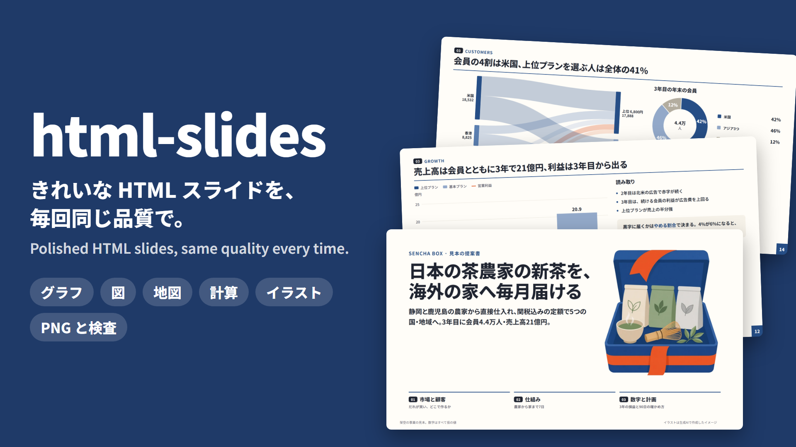

**Cursor の Agent Skill：きれいな 1920×1080 の HTML スライドを、毎回同じ品質で作る。**
グラフ・図・地図・計算の埋め込み・イラスト・PNG の書き出しと自動の検査まで 1 つに入っています。
この README の画像は、すべてこのスキルで作った見本のスライド（`examples/demo/`）をそのまま書き出したものです。

[日本語](#日本語) ・ [English](#english)

---

## 日本語

- [全体像](#全体像)
- [使い方：頼むだけ](#使い方頼むだけ)
- [できること（実際のスライド）](#できること実際のスライド)
  - [1. ページの型：結論を言い切る見出し](#1-ページの型結論を言い切る見出し)
  - [2. グラフ](#2-グラフ)
  - [3. 図](#3-図)
  - [4. 地図](#4-地図)
  - [5. 数字は計算から](#5-数字は計算から)
  - [6. イラスト](#6-イラスト)
  - [7. 発表用の型（pitch）](#7-発表用の型pitch)
  - [8. 崩れの自動検査](#8-崩れの自動検査)
  - [9. テーマ](#9-テーマ)
- [入れ方](#入れ方)・[手で使う](#手で使う)・[中身](#中身)・[ライセンス](#ライセンス)

### 全体像

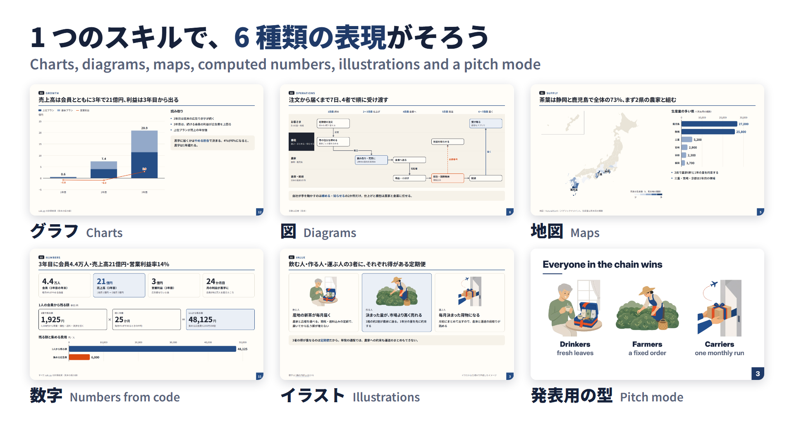

1 つの HTML ファイル（デッキ）に 1 ページ＝1 つの `<section>` を並べます。1920×1080 固定で、ブラウザの大きさに合わせて拡大縮小します。CSS・JS・データ・地図をファイルに埋め込み、フォント（Noto Sans JP・Inter）を同梱するので、**ネットなしで開けます**。

### 使い方：頼むだけ


Cursor のチャットで「◯◯の事業計画を 15 枚のスライドにして」「このページにグラフを入れて」「PNG に書き出して」と頼むと、Agent が [SKILL.md](SKILL.md) を読んで上の手順で仕上げます。最初に型（資料か発表か）・テーマ・言語を聞き、最後に全ページを検査して PNG を目で確かめます。

---

## できること（実際のスライド）

### 1. ページの型：結論を言い切る見出し


<p>


</p>

どのページも **小見出し → 結論の 1 文（h1）→ 線 → 本文 → まとめの帯 → 注記** の同じ並びです。見出しは「市場規模」のような題名ではなく「アジアの 3 つの国・地域から始め、7 か月目に北米へ広げる」のように言い切るので、見出しだけ読めば話が通ります（書き方は [reference/writing.md](reference/writing.md)）。中扉には章の並びが自動で付き、今の章が分かります。

```html
<section id="value">
  <div class="kicker"><span class="sec">01</span>VALUE</div>
  <h1>飲む人・作る人・運ぶ人の3者に、それぞれ得がある定期便</h1>
  <div class="rule"></div>
  <div class="grid">
    <div class="card"><div class="when">飲む人</div>
      <h2>産地の新茶が毎月届く</h2><p>…</p></div>
    <div class="card key">…</div>   <!-- key で強調（1 ページ 1〜2 か所） -->
  </div>
  <div class="strip">3者の得が重なるのは<b>定期便</b>だから。</div>
  <div class="foot"><span>注記・出典</span></div>
</section>
```

部品：カード・大きな数字（KPI）・足し算の流れ・時間の帯・表・横棒・左右の比べ・2×2・ピラミッド・ベン図・引用・画像（一覧は [reference/components.md](reference/components.md)）。

### 2. グラフ


<p>
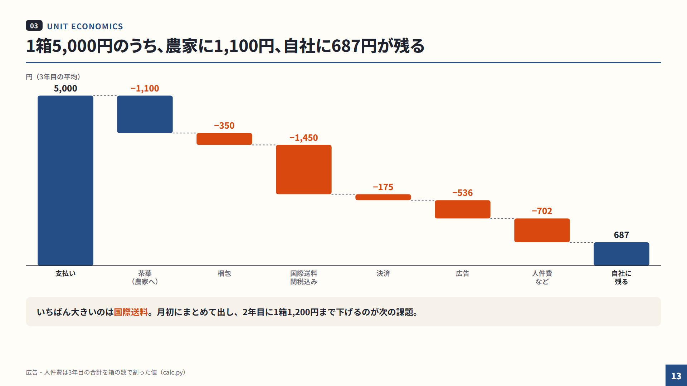
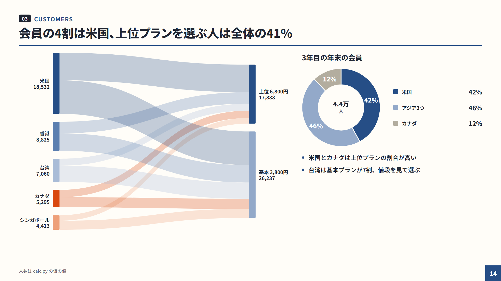
</p>
<p>
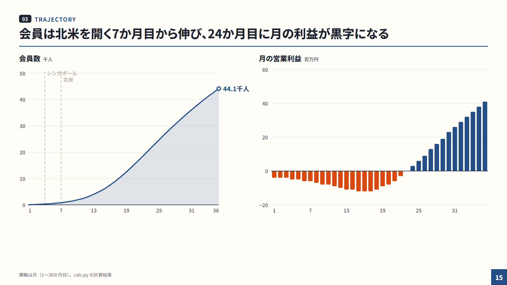
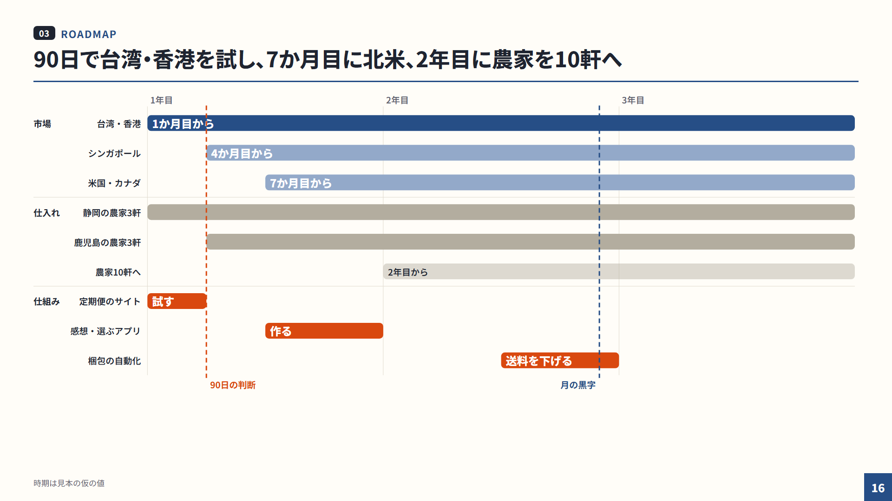
</p>

外部のライブラリを使わない自前の SVG で、テーマの色に自動で合います。上から **積み上げ棒＋線（右の軸も可）**、**滝**（1 箱の値段から利益まで）、**サンキー＋ドーナツ**、**面＋正負で色を変える棒**、**ガント**。ほかに横棒・100% 積み上げ・線・散布・バブル（下の「資料の見本の全 18 ページ」を開いた中の競合のページ）。`data-chart` に JSON を書くだけで描けます。

```html
<div class="chart" style="height:700px" data-chart='{
  "type": "bar", "stacked": true, "labels": ["1年目","2年目","3年目"], "unit": "億円",
  "series": [
    {"name": "上位プラン", "values": "@byPlan.premium", "color": "accent"},
    {"name": "基本プラン", "values": "@byPlan.standard", "color": "mid"},
    {"name": "営業利益",   "values": "@op", "type": "line", "color": "warn"}
  ]}'></div>
```

`"@byPlan.premium"` は計算結果（[5. 数字は計算から](#5-数字は計算から)）を指します。どのグラフを選ぶかの早見表は [reference/charts.md](reference/charts.md)。

### 3. 図


<p>
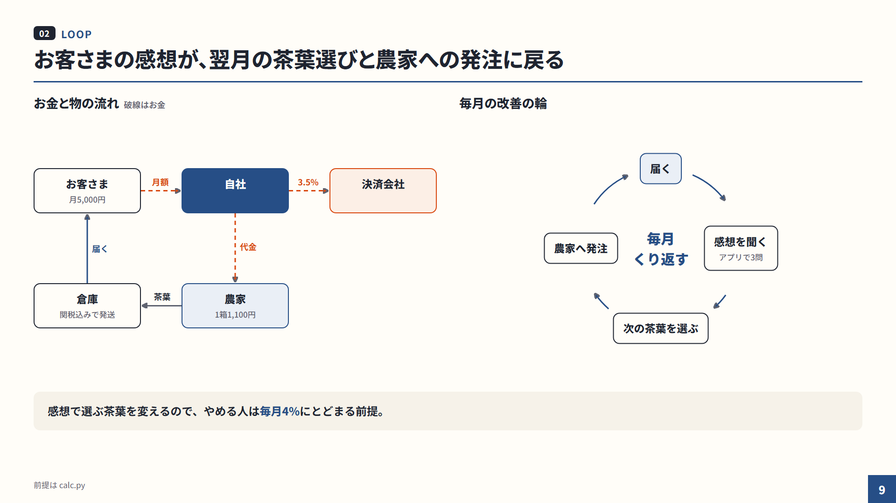

</p>

**担当者ごとのフロー図**（行＝担当、列＝段階）、**関係図**（お金の流れは破線）、**循環図**、ピラミッド、ツリー。箱は HTML で並べ、矢印は箱の id をつなぐだけで自動で引きます（直線・カギ形・曲線、ラベルの位置も自動）。

```html
<div class="lanes dgm" style="--cols:5; --rows:4"
     data-links='[["l1","l2","注文"],["l2","l3","発注"],["l6","l7","追跡番号",{"dash":true}],["l8","l9","届く",{"tone":"key"}]]'>
  <div class="who">お客さま</div>
  <div class="cell"><div class="box" id="l1">定期便の注文</div></div> …
</div>
```

詳しくは [reference/diagrams.md](reference/diagrams.md)。

### 4. 地図

<p>
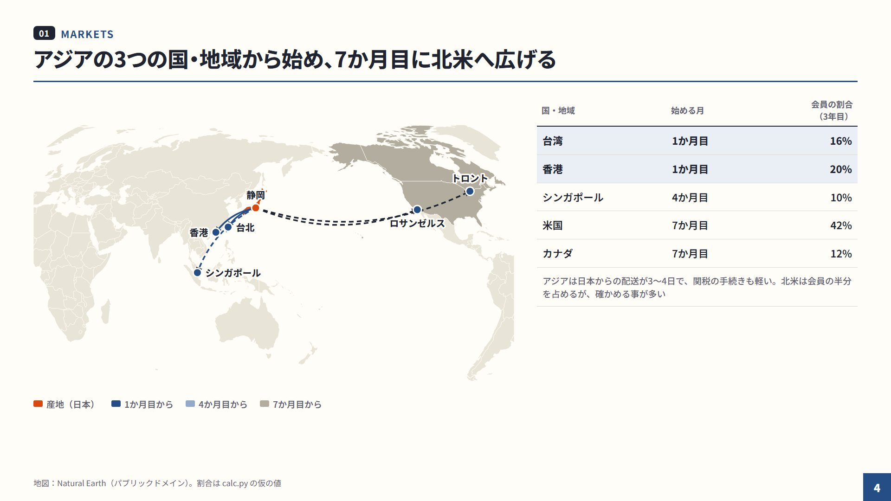

</p>

**世界地図**（太平洋を中心に、国の塗り分け・都市の点・弧の矢印）と、**日本の都道府県の塗り分け**（凡例・沖縄の差し込み付き）。ほかに国ごとの地図も。Natural Earth のデータから SVG を作ってデッキに埋め込むので、ネットなしで表示でき、色はテーマに従います。

```json
{ "name": "markets", "pacific": true,
  "fill":   { "TW": "accent", "HK": "accent", "SG": "mid", "US": "sub", "JP": "warn" },
  "arcs":   [ { "from": [138.38, 34.98], "to": "Taipei", "cls": "accent" } ],
  "points": [ { "city": "Taipei", "text": "台北", "label": "right" } ] }
```

```bash
node scripts/make-map.mjs maps.json --into slides.html   # <!--MAP:markets--> の場所に書き込む
```

詳しくは [reference/maps.md](reference/maps.md)。

### 5. 数字は計算から


スライドの数字は手で打ちません。Python で計算した結果を JSON にしてデッキに埋め込み、`data-f` とグラフの `"@path"` で参照します。前提（やめる割合・広告費など）を 1 か所変えて 3 行を実行し直すと、**見出しの数字・カード・グラフ・地図がそろって変わり**、ページ間で数字が食い違いません。

```python
# data/calc.py（抜粋）
CHURN = 0.04                                              # 毎月やめる割合
COST = {"tea": 1100, "pack": 350, "ship": 1450, "pay_rate": 0.035}   # 1箱あたり
…
data = {
    "rev": [oku(v) for v in rev_y],                                   # 年ごとの売上高（億円）
    "members": [round(members[11]), round(members[23]), round(members[35])],
    "life": round(1 / CHURN),                                         # 続く月数
    …
}
(HERE / "data.json").write_text(json.dumps(data, ensure_ascii=False, indent=1), encoding="utf-8")
```

```html
<h1>3年目に会員<span data-f="members.2" data-x="0.0001" data-d="1"></span>万人・売上高<span data-f="rev.2"></span>億円</h1>
```

```bash
python data/calc.py
node scripts/inject-data.mjs slides.html pitch.html data/data.json
```

書式は `data-d`（小数の桁）・`data-x`（掛ける数）・`data-u`（単位）・`data-sign`（＋を付ける）。流れは [reference/data.md](reference/data.md)。

### 6. イラスト

<p>


</p>

表紙とカードの絵は Cursor の画像生成（GenerateImage）で描きます。**テーマごとに固定した画風の指示**（色・線・影・余白・文字なし）を毎回付け、2 枚目からは 1 枚目を参考画像に渡すので、1 つのデッキの絵がそろいます。`scripts/to_webp.py` で背景を透明にして webp にするので、和風の生成りやダークの背景にもなじみます（指示の全文は [reference/illustrations.md](reference/illustrations.md)）。

### 7. 発表用の型（pitch）


<p>

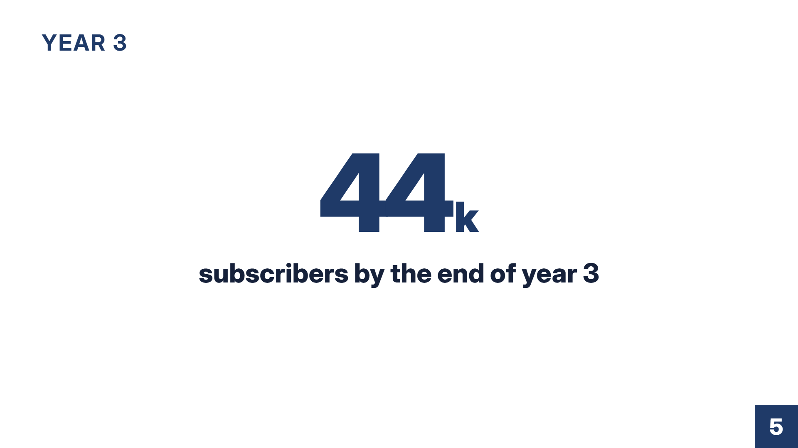
</p>

`--mode pitch` にすると、**文字はすべて 54px 以上**（検査が確かめる）、1 ページに 1 つのこと。大きな一言・大きな数字・絵 3 枚・地図・単純な棒・反転の締め、の部品があります。各ページに台本（`<aside class="notes">`）と終わりの目標時刻（`data-end="1:05"`）を書くと、**N** でメモを重ね、**P** でページ送りが連動する発表者用の窓（経過時間と目標）を開けます。資料（doc）と発表（pitch）は同じデータを共有できます。

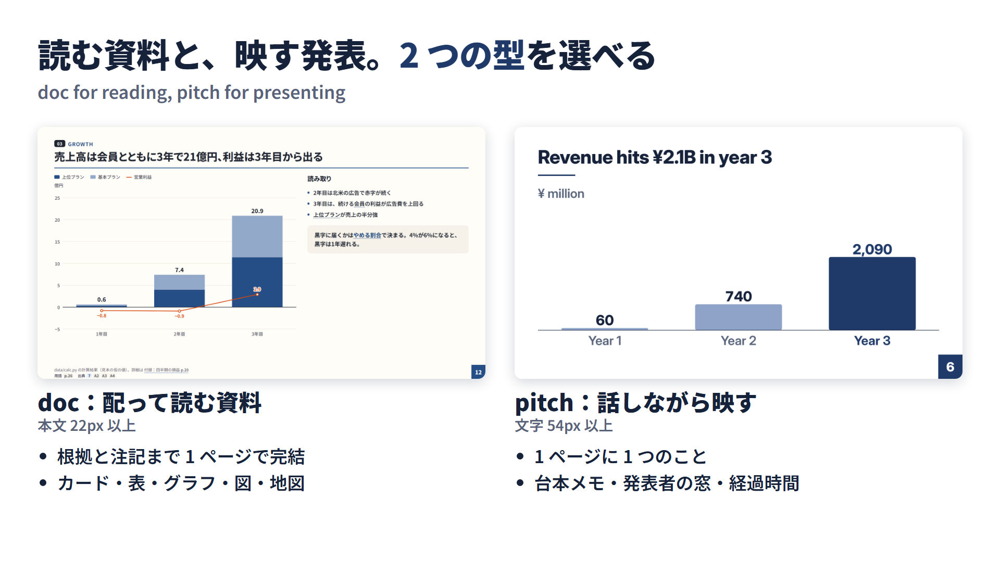

### 8. 崩れの自動検査

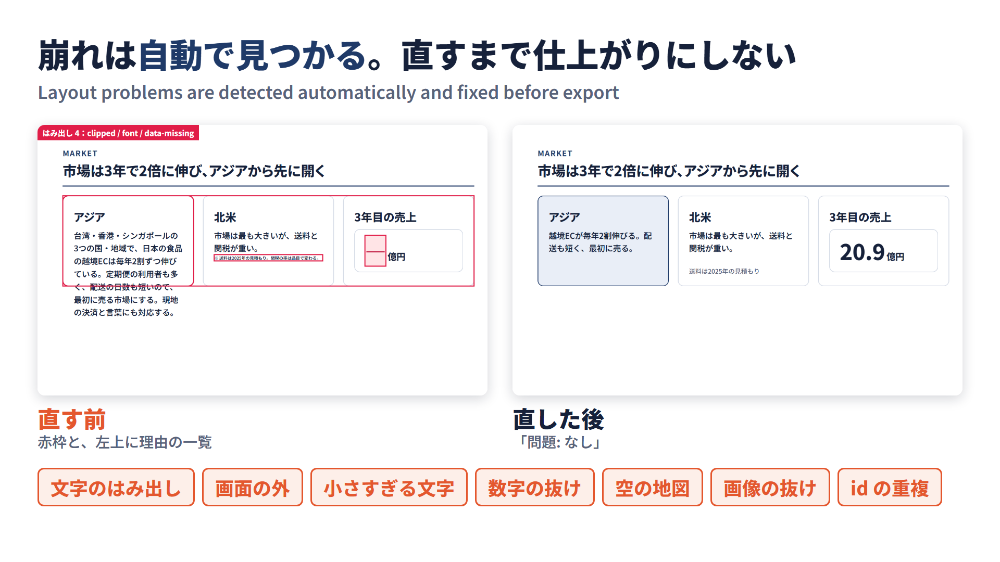

`export.mjs --check` が Chrome headless で全ページを描き、崩れを赤枠で示して一覧にします。

| 理由 | 見つけるもの |
|---|---|
| `clipped` | 箱から文字があふれている |
| `outside` | 1920×1080 の外へ出ている |
| `on-foot` | 下の注記に重なっている |
| `font` | 小さすぎる文字（doc は 16px、pitch は 54px 未満） |
| `data-missing` | 参照した計算結果がない |
| `map-empty` | 地図がまだ書き込まれていない |
| `image-missing` | 画像が読めない |
| `dup-id` | 同じ id が 2 か所（ページと図の箱など） |

Agent は「問題: なし」になるまで直してから、PNG を書き出して目で確かめます。

### 9. テーマ


`green` `navy` `mono` `blue` `wa`（和風）`dark`。どれも **強調の色** と **お金・注意の色** の 2 色＋灰色で組み、グラフ・図・地図・イラストの指示が同じ色に合います。作った後でも 1 行で変えられます。

```bash
node scripts/deck.mjs set slides.html --theme dark
node scripts/export.mjs slides.html --theme navy --out /tmp/navy   # 変えずに試し撮り
```

<details>
<summary>資料の見本の全 18 ページ</summary>

架空の日本茶の定期便の事業計画を題材にした見本です（`examples/demo/slides.html`。数字は `data/calc.py` の計算、イラストは生成 AI）。


<p>
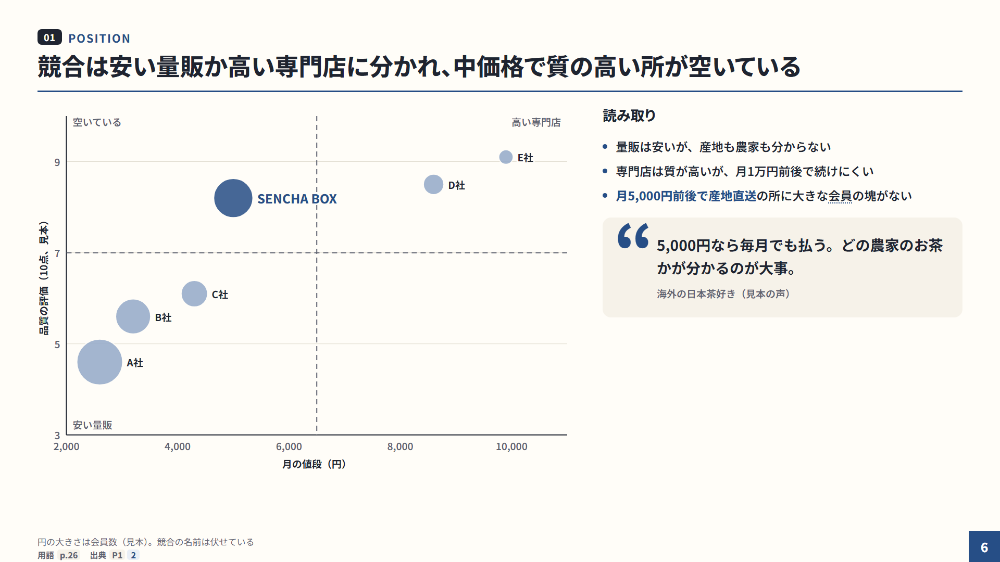
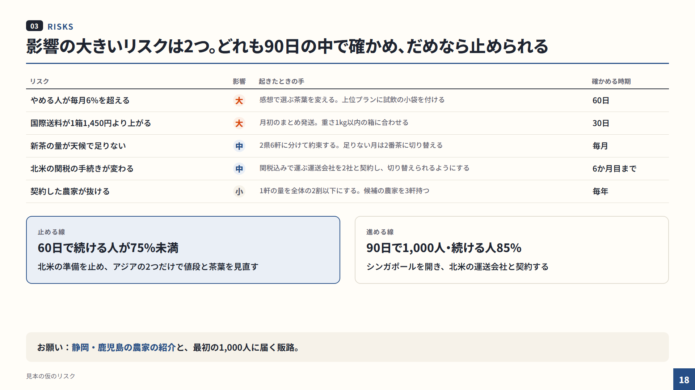
</p>

</details>

---

### 入れ方

```bash
git clone https://github.com/32Lwk/html-slides.git ~/.cursor/skills/html-slides
cd ~/.cursor/skills/html-slides/scripts && npm install     # 地図に使う d3-geo・topojson-client
```

- Windows（PowerShell）は `git clone https://github.com/32Lwk/html-slides.git "$env:USERPROFILE\.cursor\skills\html-slides"`
- 必要なもの：Node 18 以上、Chrome か Edge、Python 3（numpy。イラストの後処理に Pillow）
- Windows で Python の日本語が化けるときは環境変数 `PYTHONUTF8=1` を設定する

### 手で使う

```bash
S=~/.cursor/skills/html-slides/scripts
node $S/deck.mjs new ./my-deck --mode doc --theme green --lang ja --title "題名"   # デッキを作る
python calc.py && node $S/inject-data.mjs ./my-deck/slides.html data.json      # 計算を埋め込む
node $S/make-map.mjs maps.json --into ./my-deck/slides.html                      # 地図を書き込む
node $S/export.mjs ./my-deck/slides.html --check                                 # 検査（問題のページと理由）
node $S/export.mjs ./my-deck/slides.html --sheet                                 # PNG と一覧の sheet.png
```

ブラウザでは ← → ・スペースでページ送り、**F** で全画面。`slides.html#growth` のように id を付けるとそのページから開きます。

### 中身

| パス | 中身 |
|---|---|
| [SKILL.md](SKILL.md) | Agent が読む手順（最初に決めること・手順・検査の直し方・コマンド） |
| [reference/](reference/) | 書き方・部品・グラフ・図・地図・データ・イラストの詳しい説明 |
| `assets/` | テーマ・CSS・ランタイム・グラフ・図・フォント・地図のデータ |
| `scripts/` | `deck.mjs`（作る・更新）`export.mjs`（書き出し・検査）`inject-data.mjs` `make-map.mjs` `to_webp.py` |
| `templates/` | `deck new` の元（doc・pitch） |
| `examples/demo/` | 見本のデッキ・計算・地図の仕様・PNG |
| [examples/project-skill/SKILL.template.md](examples/project-skill/SKILL.template.md) | 案件ごとの約束（表記・出典・公開手順）を書くプロジェクトスキルのひな形 |
| `docs/figures/` | この README の図（図もこのスキルで作っている。`node docs/figures/build.mjs` で作り直す） |

**2 段の使い方**：汎用のデザインと道具はこの個人スキルに、案件ごとの約束（用語・為替・出典・公開の手順）はリポジトリの `.cursor/skills/<名前>/SKILL.md` に分けると、どの案件でも同じ見た目で作れます。ひな形は実際の案件で使ったプロジェクトスキルから事業の中身を抜いたものです。

### ライセンス

スキル本体は [MIT](LICENSE)。同梱のフォント（Noto Sans JP・Inter）は SIL OFL 1.1、地図のデータは Natural Earth（パブリックドメイン）。詳しくは [THIRD_PARTY.md](THIRD_PARTY.md)。

---

## English

**A Cursor Agent Skill for building polished 1920×1080 HTML slide decks with consistent quality** — charts, diagrams, maps, computed numbers, illustrations, PNG export and automatic layout checks in one package. Every image here is a slide exported from the demo deck (`examples/demo/`). The skill documentation is written in Japanese; decks can be English (`--lang en`, see the pitch demo).


| | What you get | Example |
|---|---|---|
| **Page pattern** | Every slide: kicker → one-sentence takeaway headline → body → summary strip → footnote | [cover](examples/demo/png/01-cover.png), [cards](examples/demo/png/03-value.png) |
| **Charts** | Built-in SVG: stacked bar + line (secondary axis), waterfall, Sankey, donut, area, Gantt, scatter/bubble — one JSON spec in `data-chart` | [growth](examples/demo/png/12-growth.png), [unit](examples/demo/png/13-unit.png), [mix](examples/demo/png/14-mix.png), [roadmap](examples/demo/png/16-roadmap.png) |
| **Diagrams** | Swimlane flows, relationship diagrams (dashed = money), cycles, pyramids, trees; arrows routed automatically between box ids | [lanes](examples/demo/png/08-lanes.png), [loop](examples/demo/png/09-loop.png) |
| **Maps** | World (Pacific-centered, fills, points, arcs), single countries, Japanese prefecture choropleth with Okinawa inset — generated from Natural Earth, embedded as SVG | [world](examples/demo/png/04-markets.png), [Japan](examples/demo/png/05-farms.png) |
| **Numbers from code** | A Python model writes JSON; headlines, cards and charts reference it via `data-f` / `"@path"`, so numbers never drift | [kpi](examples/demo/png/11-kpi.png) |
| **Illustrations** | Fixed per-theme style prompts for image generation + background removal to webp | [cards](examples/demo/png/03-value.png) |
| **Pitch mode** | All text ≥ 54px (checked), speaker notes, synced presenter window with timer | [pitch sheet](examples/demo/png-pitch/sheet.png) |
| **Automatic checks** | Headless Chrome flags overflow, off-canvas, tiny text, missing data, empty maps, missing images, duplicate ids | see below |
| **Themes** | `green` `navy` `mono` `blue` `wa` `dark`, switchable in one command | see below |


### Install

```bash
git clone https://github.com/32Lwk/html-slides.git ~/.cursor/skills/html-slides
cd ~/.cursor/skills/html-slides/scripts && npm install
```

Requires Node 18+, Chrome or Edge, and Python 3 (numpy; Pillow for illustrations). Then ask Cursor's Agent to "make slides about …", "add a chart", or "export to PNG" — it reads [SKILL.md](SKILL.md) and follows the workflow.

### Manual use

```bash
S=~/.cursor/skills/html-slides/scripts
node $S/deck.mjs new ./my-deck --mode pitch --theme navy --lang en --title "Title"
node $S/inject-data.mjs ./my-deck/slides.html data.json
node $S/make-map.mjs maps.json --into ./my-deck/slides.html
node $S/export.mjs ./my-deck/slides.html --check
node $S/export.mjs ./my-deck/slides.html --sheet
```

### License

The skill is [MIT](LICENSE). Bundled fonts (Noto Sans JP, Inter) are under the SIL OFL 1.1 and map data is from Natural Earth (public domain). See [THIRD_PARTY.md](THIRD_PARTY.md).
